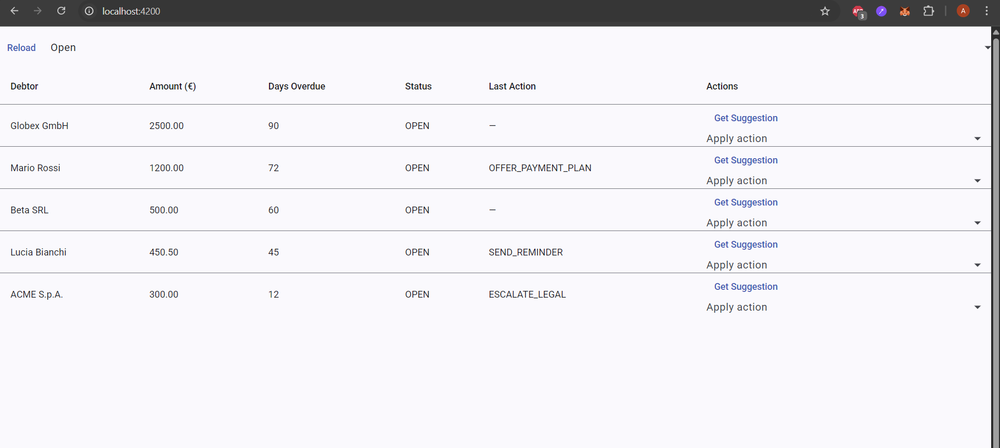
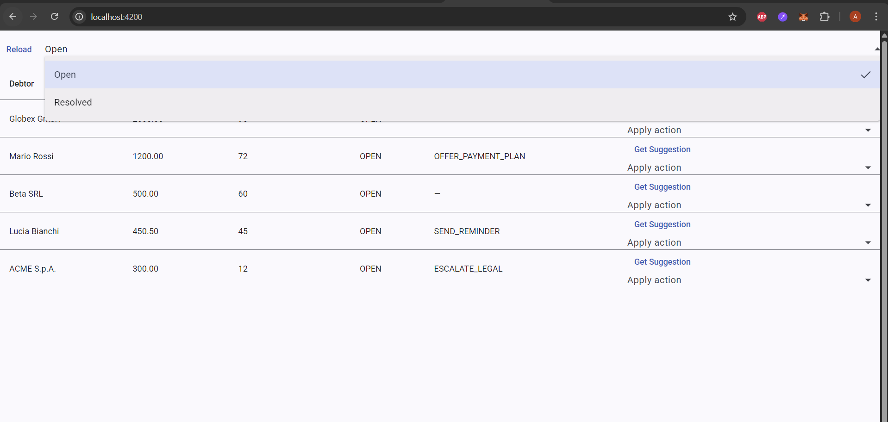
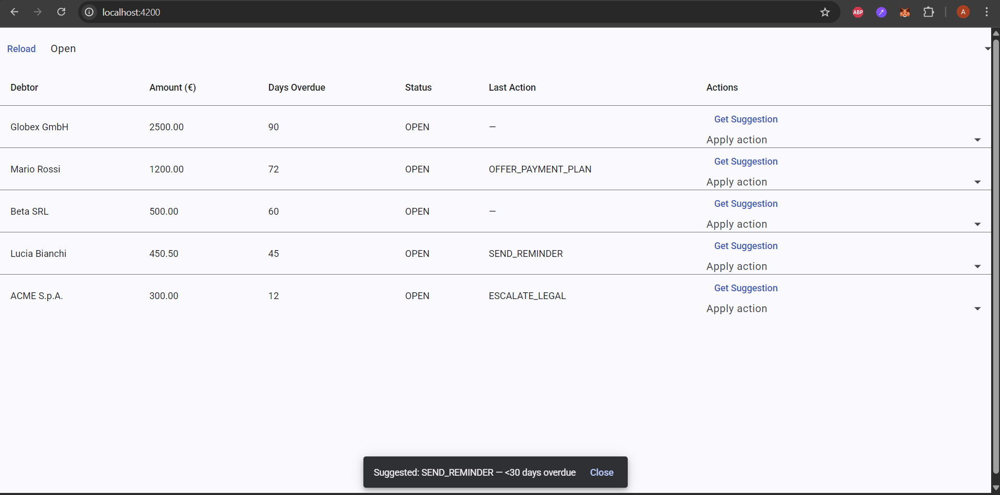
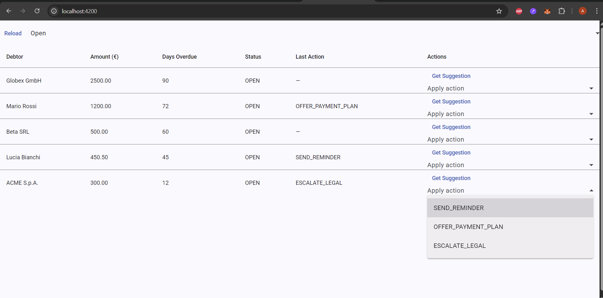

# 💼 JustSolve Technical Challenge — Debt Action Management App

This project is my submission for the **JustSolve Full-Stack Developer Technical Challenge**.  
It implements a complete **Laravel 12 (PHP 8.3)** backend API and an **Angular 20** frontend UI for managing overdue debts — following all the given business and technical requirements.

---

## 🚀 Project Overview

### 🎯 Goal
Build a small system to:
1. List overdue debts  
2. Suggest the next action for each debt  
3. Apply that action and update the list in real time

### 🧠 Logic Implemented
| Condition | Suggested Action | Reason |
|------------|------------------|--------|
| `days_overdue ≥ 60` **AND** `amount ≥ 1000 EUR` | **ESCALATE_LEGAL** | “≥60 days & ≥1000€” |
| `days_overdue ≥ 30` | **OFFER_PAYMENT_PLAN** | “≥30 days overdue” |
| Else | **SEND_REMINDER** | “<30 days overdue” |

---

## 🏗️ Architecture

```
justsolve-debt-action-app/
│
├── debts-api/          # Laravel 12 backend (REST API)
│   ├── app/
│   ├── routes/api.php
│   ├── database/database.sqlite
│   └── .env
│
├── debts-ui/           # Angular 20 frontend
│   ├── src/app/core/...
│   ├── src/app/features/debts/debts-table/...
│   ├── angular.json
│   └── package.json
│
└── screenshots/        # Preview screenshots
    ├── angular-running.png
    ├── open.png
    ├── resolved.png
    ├── get-suggestion.png
    └── apply-action.png
```

---

## ⚙️ Backend (Laravel 12)

### Setup
```bash
cd debts-api
composer install
cp .env.example .env
php artisan key:generate
```

### Database
Using **SQLite** (lightweight, no setup required).

Edit `.env`:
```env
DB_CONNECTION=sqlite
DB_DATABASE=database/database.sqlite
```

Create file and migrate:
```bash
type nul > database/database.sqlite
php artisan migrate --seed
```

### Run
```bash
php artisan serve
```

API will run at:  
👉 **http://127.0.0.1:8000**

---

## 💅 Frontend (Angular 20)

### Setup
```bash
cd debts-ui
npm install
```

### Run
```bash
ng serve --open
```

Frontend will open at:  
👉 **http://localhost:4200**

The UI automatically connects to Laravel’s API at `http://127.0.0.1:8000/api`.

---

## 🧩 Features

✅ List all open debts (sorted by days overdue)  
✅ Get intelligent action suggestions per debt  
✅ Apply action (updates instantly)  
✅ Separate API and UI layers (scalable architecture)  
✅ Type-safe Angular models & services  
✅ Proper Laravel validation (`FormRequest`)  
✅ CORS configured for frontend–backend communication  
✅ SQLite storage (no setup required)

---

## 🧪 Example API Endpoints

| Method | Endpoint | Description |
|--------|-----------|--------------|
| `GET` | `/api/debts` | List all open debts |
| `POST` | `/api/debts` | Add a new debt |
| `GET` | `/api/debts/{id}/suggestion` | Get suggested action |
| `POST` | `/api/debts/{id}/apply` | Apply selected action |

---

## 🖼️ Screenshots

| Screenshot | Description |
|-------------|-------------|
|  | Angular app running on `localhost:4200` |
|  | List of open debts |
|  | Suggestion modal showing next action |
|  | Applying action updates the record |
|  | Resolved debts view |

---

## 🧠 Technical Decisions

- **SQLite** chosen for simplicity & portability  
- **Laravel FormRequest** for validation & clean controllers  
- **Angular Material** used for table, button, and select components  
- **Service-based architecture** (`DebtApiService`) for API abstraction  
- **CORS** enabled for `localhost:4200` frontend  
- **Zoneless Angular App** (modern signal-based setup for high performance)

---

## 💡 Potential Improvements (if continued)

- Add authentication (Laravel Sanctum + Angular Interceptors)  
- Add filters, pagination, and sorting on the frontend  
- Unit & feature tests for both layers  
- Deploy using Docker or Laravel Sail  
- Store audit logs for applied actions  
- Integrate i18n for multi-language support  

---

## 🧰 Tech Stack
**Backend:** Laravel 12, PHP 8.3, SQLite  
**Frontend:** Angular 20, TypeScript, Angular Material  
**Tools:** Composer, NPM, VSCode, GitHub, Postman  

---

## 👨‍💻 Developed by
**Arifur Rahman**  
MSc in Computer Science, University of Camerino (Italy)  
Full-Stack Developer  
📧 arifurcodice@gmail.com  
https://arifurrahman.top/
---
